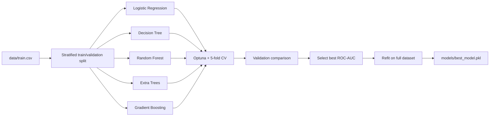

# Titanic Survival Prediction

An end-to-end machine-learning project for predicting Titanic passenger
survival. It compares multiple classification algorithms, tunes them with
Optuna, tracks the reproducible experiment pipeline with DVC, and orchestrates
retraining with Apache Airflow.

The final artifact is a self-contained scikit-learn pipeline that accepts raw
Titanic passenger data and applies feature engineering, preprocessing, and
prediction in one call.

## Highlights

- Five classification algorithms evaluated under the same conditions
- Titanic-specific feature engineering inside the model pipeline
- Deterministic Optuna hyperparameter optimization
- Stratified holdout validation and five-fold cross-validation
- DVC pipeline with tracked parameters, dependencies, metrics, and models
- Airflow 3 DAG with one dynamically mapped task per enabled model
- Automatic best-model selection and refitting on the complete training set
- Docker-based Airflow setup that also works on Windows
- Unit tests for every registered model and pipeline reproducibility

## Model comparison

The current experiment uses validation ROC-AUC as the selection metric.

| Model | Accuracy | Precision | Recall | F1 | ROC-AUC |
|---|---:|---:|---:|---:|---:|
| Logistic Regression | 0.8268 | 0.8167 | 0.7101 | 0.7597 | **0.8706** |
| Random Forest | 0.7933 | 0.7667 | 0.6667 | 0.7132 | 0.8470 |
| Gradient Boosting | 0.7877 | 0.7627 | 0.6522 | 0.7031 | 0.8456 |
| Extra Trees | **0.8324** | **0.8197** | **0.7246** | **0.7692** | 0.8455 |
| Decision Tree | 0.7933 | 0.7500 | 0.6957 | 0.7218 | 0.8245 |

Logistic Regression is selected because it has the highest validation ROC-AUC.
Its best Optuna configuration is:

```json
{
  "C": 0.2054878640884927,
  "class_weight": null
}
```

After selection, the winning pipeline is refitted on all 891 labeled rows and
saved as `models/best_model.pkl`.

## Architecture



DVC and Airflow use the same Python modules:

- **DVC** handles local reproducibility, caching, parameters, metrics, and
  experiment comparison.
- **Airflow** handles orchestration, model-level task mapping, retries, and
  scheduled or manual retraining.

## Feature pipeline

Feature engineering is included inside the serialized scikit-learn pipeline,
which prevents training/serving skew.

Generated features:

- `FamilySize` — total family members traveling together
- `IsAlone` — whether the passenger traveled alone
- `FarePerPerson` — fare normalized by family size
- `Title` — normalized title extracted from the passenger name
- `Deck` — deck extracted from the cabin
- `AgeGroup` — categorical age range

Preprocessing:

- Numeric columns: median imputation and standard scaling
- Categorical columns: most-frequent imputation and one-hot encoding
- Unknown categories: ignored safely during inference

## Repository structure

```text
.
|-- .dvc/                           # DVC project configuration
|-- dags/
|   `-- titanic_training_dag.py     # Airflow training DAG
|-- data/
|   |-- train.csv                   # Labeled Kaggle dataset
|   |-- test.csv                    # Unlabeled Kaggle test dataset
|   `-- processed/                  # DVC-cached train/validation split
|-- models/
|   |-- candidates/                 # DVC-cached candidate pipelines
|   |-- best_model.pkl              # DVC-cached production pipeline
|   `-- best_model.json             # Selected model metadata
|-- notebooks/
|   `-- 01_EDA.ipynb
|-- reports/
|   `-- metrics/
|       |-- candidates/             # Detailed metrics for each model
|       `-- summary.json            # DVC comparison metric
|-- src/
|   |-- config.py
|   |-- evaluate.py
|   |-- feature_engineering.py
|   |-- model.py
|   |-- predict.py
|   |-- prepare_data.py
|   |-- preprocessing.py
|   |-- select_model.py
|   |-- settings.py
|   |-- train.py
|   |-- tuning.py
|   `-- utils.py
|-- tests/
|   `-- test_training_pipeline.py
|-- docker-compose.airflow.yml
|-- Dockerfile.airflow
|-- dvc.lock
|-- dvc.yaml
|-- params.yaml
|-- requirements-airflow.txt
`-- requirements.txt
```

## Requirements

- Python 3.12 or newer
- Git
- Docker Desktop or Docker Engine with Compose, only for Airflow

## Installation

Clone the repository and enter the project directory:

```bash
git clone https://github.com/ZOKHIDKHANJAROV/Titanic-Survival-Prediction.git
cd Titanic-Survival-Prediction
```

Create a virtual environment:

```bash
python -m venv .venv
```

Activate it on Windows:

```powershell
.\.venv\Scripts\Activate.ps1
```

Or on Linux and macOS:

```bash
source .venv/bin/activate
```

Install the dependencies:

```bash
python -m pip install --upgrade pip
python -m pip install -r requirements.txt
```

## Run the DVC pipeline

Run the complete reproducible workflow:

```bash
dvc repro
```

DVC executes:

```text
prepare -> train_models -> select_best
```

The stages:

1. Create a deterministic stratified train/validation split.
2. Tune and evaluate every enabled model.
3. Select the best validation result and refit that model on all labeled data.

Inspect the resulting metrics:

```bash
dvc metrics show
```

Display the dependency graph:

```bash
dvc dag
```

The raw Kaggle CSV files are stored in Git because this dataset is small. DVC
caches processed data and model artifacts. A remote is not configured by
default. To share the cache, add one and push:

```bash
dvc remote add -d storage <remote-url>
dvc push
```

## Run DVC experiments

All experiment settings are in `params.yaml`:

```yaml
data:
  test_size: 0.2
  random_state: 42

training:
  cv_folds: 5
  n_trials: 20
  n_jobs: 1
  scoring: roc_auc
  selection_metric: roc_auc
```

Run an experiment with more Optuna trials without editing the file:

```bash
dvc exp run -S training.n_trials=40
```

Compare experiments:

```bash
dvc exp show
```

To exclude a model, set its `enabled` value to `false`:

```yaml
models:
  decision_tree:
    enabled: false
```

The change applies to both DVC and Airflow runs.

## Direct CLI usage

The individual pipeline steps can also be executed without DVC:

```bash
python -m src.prepare_data
python -m src.train --all
python -m src.select_model
```

Train only one candidate:

```bash
python -m src.train --model random_forest
```

Run a quick smoke experiment with one Optuna trial per model:

```bash
python -m src.train --all --n-trials 1
```

## Prediction

Generate a prediction with the selected model:

```bash
python -m src.predict
```

Python example:

```python
import pandas as pd

from src.predict import predict


passenger = pd.DataFrame(
    [
        {
            "PassengerId": 892,
            "Pclass": 3,
            "Name": "Ivanov, Mr. Ivan",
            "Sex": "male",
            "Age": 28,
            "SibSp": 0,
            "Parch": 0,
            "Ticket": "A/5 21171",
            "Fare": 7.25,
            "Cabin": None,
            "Embarked": "S",
        }
    ]
)

labels, probabilities = predict(passenger)
print(labels[0])
print(probabilities[0, 1])
```

No manual preprocessing is required because the saved artifact contains feature
engineering and preprocessing.

## Airflow

The project uses the official Apache Airflow 3.3 slim image with Python 3.12.
Airflow itself is not installed in the local Windows virtual environment.

Build and start the local Airflow instance:

```bash
docker compose -f docker-compose.airflow.yml up --build
```

Open:

```text
http://localhost:8080
```

The standalone server prints generated administrator credentials in its startup
log. In the Airflow UI, enable and manually trigger:

```text
titanic_model_training
```

The DAG performs:

```text
prepare_dataset
        |
get_enabled_models
        |
train_candidate [one mapped task per enabled model]
        |
select_best_model
```

Training is manual by default because the DAG uses `schedule=None`. Set a cron
expression in `dags/titanic_training_dag.py` when scheduled retraining is
required.

Stop Airflow:

```bash
docker compose -f docker-compose.airflow.yml down
```

The included single-container `standalone` configuration is intended for local
development and demonstration. Use an appropriate executor, metadata database,
secrets management, and deployment platform for production.

## Tests

Run the test suite:

```bash
python -m unittest discover -s tests -v
```

The tests verify:

- Every registered model can fit and produce class probabilities
- Engineered features reach the preprocessing stage
- Optuna produces identical results when the seed is fixed

## Reproducibility

The experiment is deterministic under the same dependency versions because:

- Train/validation splitting uses `random_state=42`
- Cross-validation uses shuffled `StratifiedKFold` with the same seed
- Every stochastic estimator receives the same seed
- Optuna uses a seeded `TPESampler`
- Parallel model internals are limited to avoid nested nondeterminism
- DVC tracks source dependencies, parameters, outputs, and metrics in
  `dvc.lock`

## Author

**Zokhidkhan Jarov**

[GitHub](https://github.com/ZOKHIDKHANJAROV)
